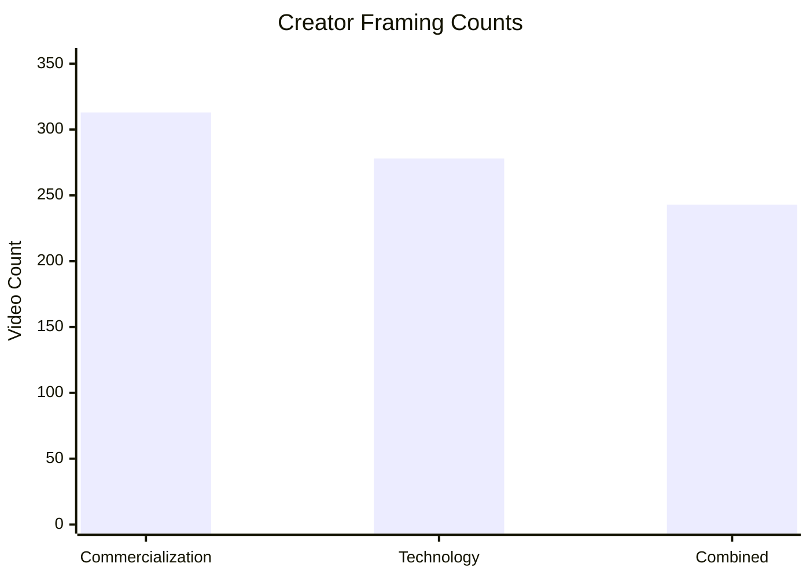
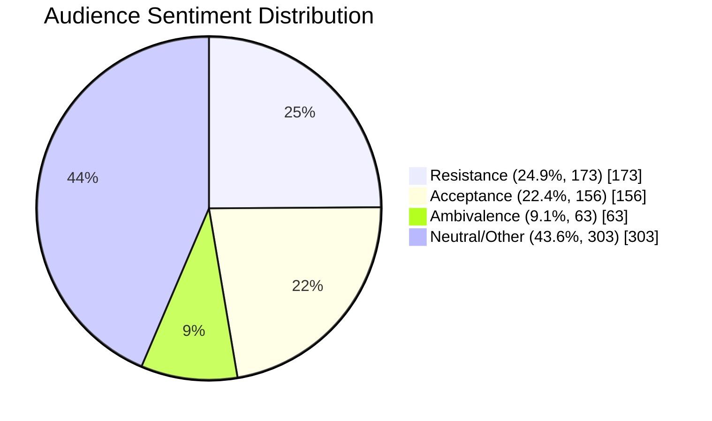
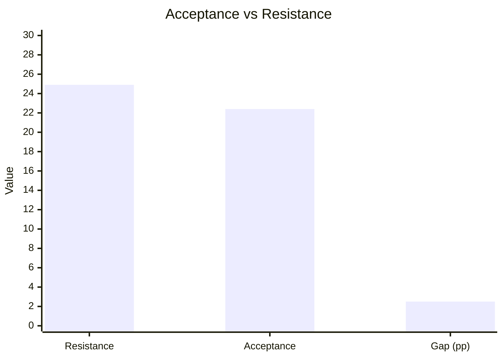

# TGL Project - Consolidated Code Used

This document contains all code artifacts created in this chat.

---

## 1) Full Canvas Version
**Original path:** `canvases/tgl-key-findings-figures.canvas.tsx`

```tsx
import {
  BarChart,
  Callout,
  Divider,
  Grid,
  H1,
  H2,
  PieChart,
  Stack,
  Stat,
  Table,
  Text,
} from "cursor/canvas";

export default function TGLKeyFindingsFigures() {
  const creatorTotal = 355;
  const commercialCount = 313;
  const techCount = 278;
  const combinedCount = 243;

  const modelCommentTotal = 695;
  const resistanceCount = 173;
  const acceptanceCount = 156;
  const ambivalentCount = 63;
  const neutralOrOtherCount =
    modelCommentTotal - resistanceCount - acceptanceCount - ambivalentCount;

  return (
    <Stack gap={20}>
      <H1>TGL Key Findings: Ready-to-Use Figures</H1>
      <Text tone="secondary">
        Source-aligned visuals based on `TGL_Presentation_Slides.md`,
        `CursorPros_Presentation_P2.pdf`, and `TGL_Analysis_Report.md`.
      </Text>

      <Grid columns={4} gap={14}>
        <Stat value="355" label="Videos analyzed" />
        <Stat value="6,102" label="Total comments collected" />
        <Stat value="695" label="Model-specific comments" />
        <Stat value="43.6%" label="Neutral/other model comments" tone="info" />
      </Grid>

      <Divider />

      <H2>Figure 1: Creator Framing Prevalence</H2>
      <Text tone="secondary" size="small">
        Shows how often creators framed TGL through commercialization, technology,
        and their overlap (counts out of 355 videos).
      </Text>
      <BarChart
        categories={["Commercialization", "Technology", "Combined frame"]}
        series={[
          {
            name: "Video count",
            data: [commercialCount, techCount, combinedCount],
          },
        ]}
        height={280}
      />
      <Table
        headers={["Creator frame", "Count", "Percent of 355"]}
        rows={[
          ["Commercialization emphasis", "313", "88.2%"],
          ["Technology emphasis", "278", "78.3%"],
          ["Combined commercial + tech framing", "243", "68.5%"],
        ]}
        columnAlign={["left", "right", "right"]}
      />

      <Divider />

      <H2>Figure 2: Audience Reaction Distribution (Model-Specific)</H2>
      <Text tone="secondary" size="small">
        Distribution within 695 comments directly discussing TGL&apos;s
        tech-driven entertainment model.
      </Text>
      <Grid columns={2} gap={16}>
        <PieChart
          donut
          data={[
            { label: "Resistance (173)", value: resistanceCount, tone: "danger" },
            { label: "Acceptance (156)", value: acceptanceCount, tone: "success" },
            { label: "Ambivalence (63)", value: ambivalentCount, tone: "warning" },
            {
              label: "Neutral/Other (303)",
              value: neutralOrOtherCount,
              tone: "neutral",
            },
          ]}
          size={320}
        />
        <BarChart
          categories={["Resistance", "Acceptance", "Ambivalence", "Neutral/Other"]}
          series={[
            {
              name: "Comment share",
              data: [24.9, 22.4, 9.1, 43.6],
            },
          ]}
          height={300}
          valueSuffix="%"
        />
      </Grid>

      <Divider />

      <H2>Figure 3: Split Dynamics (Acceptance vs Resistance)</H2>
      <Text tone="secondary" size="small">
        Highlights the near-even split between supportive and opposing audiences.
      </Text>
      <Grid columns={3} gap={14}>
        <Stat value="24.9%" label="Resistance share" tone="danger" />
        <Stat value="22.4%" label="Acceptance share" tone="success" />
        <Stat value="2.5 pp" label="Gap (resistance - acceptance)" tone="warning" />
      </Grid>

      <Callout tone="info" title="Interpretive takeaway">
        Creator messaging is strongly aligned around commercialization + technology,
        while audience sentiment is split with substantial neutral/uncoded reaction.
        This supports your &quot;traditionalism vs modernity&quot; interpretation and
        the strategic importance of converting ambivalent viewers.
      </Callout>

      <Text tone="tertiary" size="small">
        Note: Percentages and counts are reproduced from your existing analysis;
        overlap among creator framing categories is expected and methodologically
        appropriate.
      </Text>
    </Stack>
  );
}
```

---

## 2) Presentation Canvas Version
**Original path:** `tgl-key-findings-figures-presentation.canvas.tsx`

```tsx
import { BarChart, Divider, Grid, H1, H2, PieChart, Stack, Stat, Text } from "cursor/canvas";

export default function TGLKeyFindingsFiguresPresentation() {
  return (
    <Stack gap={24}>
      <H1>TGL Key Findings (Presentation Version)</H1>
      <Grid columns={4} gap={16}>
        <Stat value="355" label="Videos" />
        <Stat value="6,102" label="Comments" />
        <Stat value="695" label="Model-specific comments" />
        <Stat value="43.6%" label="Neutral/other" tone="info" />
      </Grid>

      <Divider />

      <H2>Figure 1: Creator Framing</H2>
      <BarChart
        categories={["Commercial", "Technology", "Combined"]}
        series={[
          { name: "Count", data: [313, 278, 243] },
          { name: "Percent", data: [88.2, 78.3, 68.5] },
        ]}
        height={360}
      />
      <Text tone="secondary" size="small">
        313/355 commercial framing (88.2%), 278/355 technology framing (78.3%),
        243/355 combined framing (68.5%).
      </Text>

      <Divider />

      <H2>Figure 2: Audience Sentiment Split</H2>
      <Grid columns={2} gap={18}>
        <PieChart
          donut
          size={360}
          data={[
            { label: "Resistance 24.9% (173)", value: 173, tone: "danger" },
            { label: "Acceptance 22.4% (156)", value: 156, tone: "success" },
            { label: "Ambivalence 9.1% (63)", value: 63, tone: "warning" },
            { label: "Neutral/Other 43.6% (303)", value: 303, tone: "neutral" },
          ]}
        />
        <BarChart
          categories={["Resistance", "Acceptance", "Ambivalence", "Neutral/Other"]}
          series={[{ name: "Percent", data: [24.9, 22.4, 9.1, 43.6] }]}
          height={360}
          valueSuffix="%"
        />
      </Grid>

      <Divider />

      <H2>Figure 3: Acceptance vs Resistance</H2>
      <Grid columns={3} gap={16}>
        <Stat value="24.9%" label="Resistance" tone="danger" />
        <Stat value="22.4%" label="Acceptance" tone="success" />
        <Stat value="2.5 pp" label="Gap" tone="warning" />
      </Grid>
    </Stack>
  );
}
```

---

## 3) GitHub Web Display Version
**Original path:** `TGL_Key_Findings_Figures_GitHub.md`

```md
# TGL Key Findings Figures (GitHub Display Version)

This file is designed to render directly on GitHub web using Mermaid charts.

## Figure 1: Creator Framing (Out of 355 Videos)



- Commercialization: **313 / 355 (88.2%)**
- Technology: **278 / 355 (78.3%)**
- Combined framing: **243 / 355 (68.5%)**

## Figure 2: Audience Model-Specific Sentiment (n = 695)



## Figure 3: Acceptance vs Resistance Gap



### Data Source Notes

- Values reproduced from `TGL_Presentation_Slides.md`, `CursorPros_Presentation_P2.pdf`, and `TGL_Analysis_Report.md`.
- Percentages are reported values from your analysis pipeline.
- Creator framing categories intentionally overlap by design.
```
