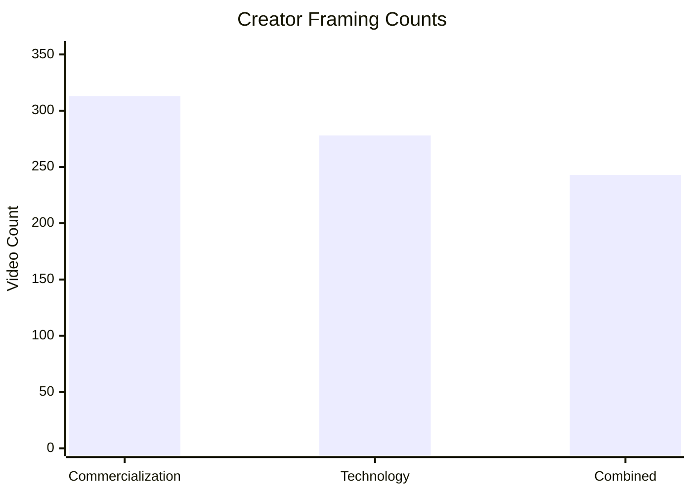
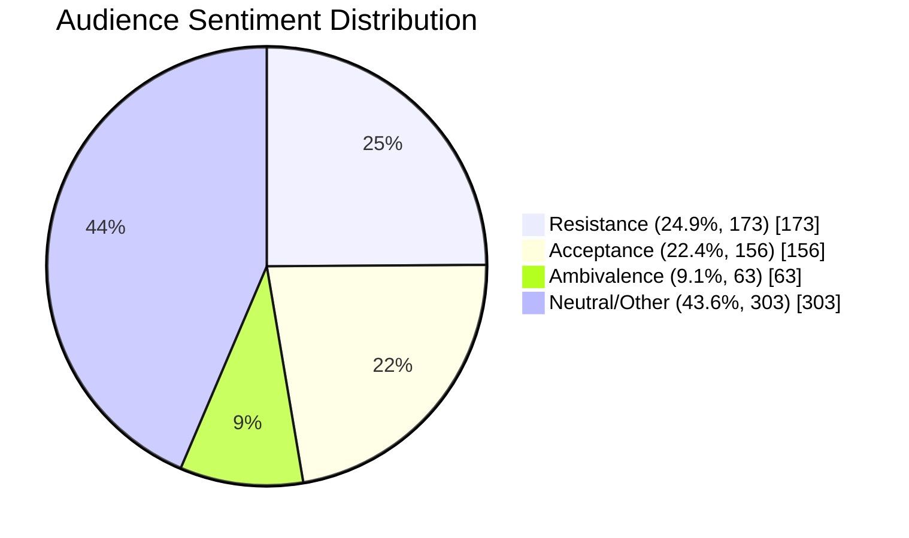
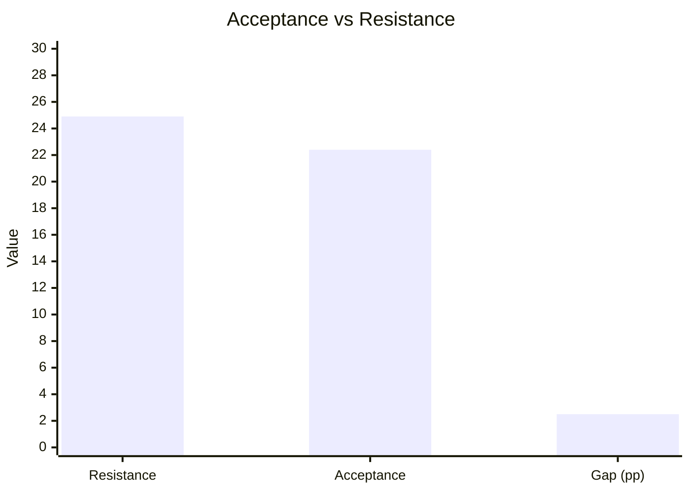

# TGL Key Findings Figures (GitHub Display Version)

This file is designed to render directly on GitHub web using Mermaid charts.

## Figure 1: Creator Framing (Out of 355 Videos)

- Commercialization: **313 / 355 (88.2%)**
- Technology: **278 / 355 (78.3%)**
- Combined framing: **243 / 355 (68.5%)**

## Figure 2: Audience Model-Specific Sentiment (n = 695)

## Figure 3: Acceptance vs Resistance Gap

### Data Source Notes

- Values reproduced from `TGL_Presentation_Slides.md`, `CursorPros_Presentation_P2.pdf`, and `TGL_Analysis_Report.md`.
- Percentages are reported values from your analysis pipeline.
- Creator framing categories intentionally overlap by design.
