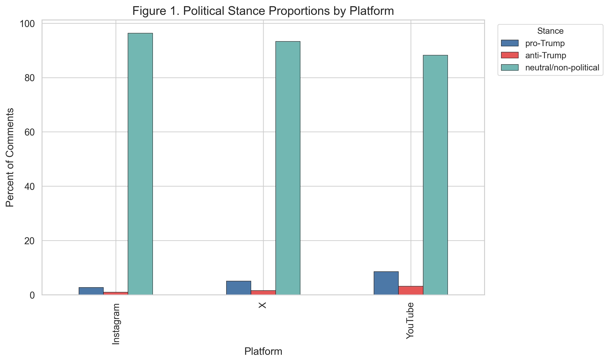
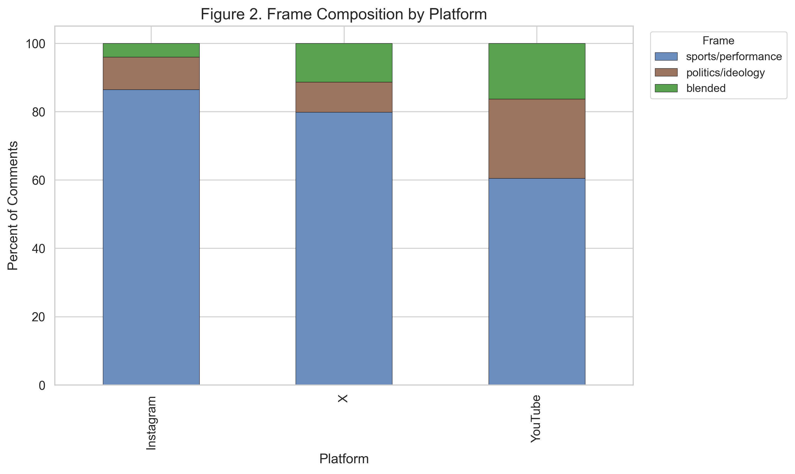
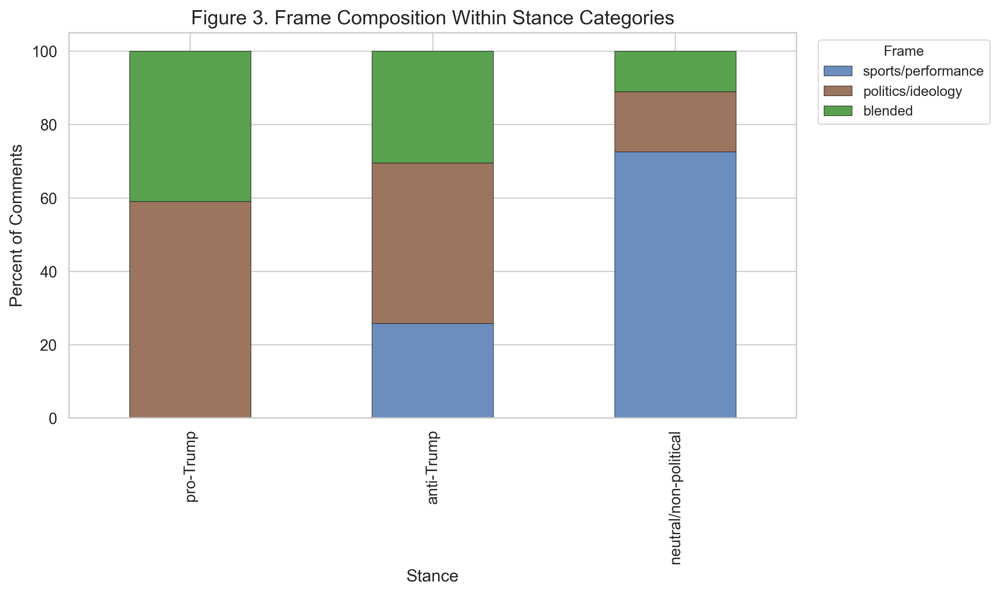
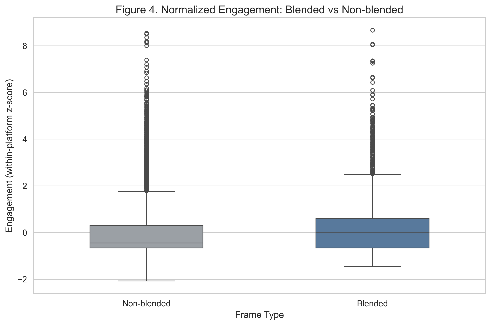
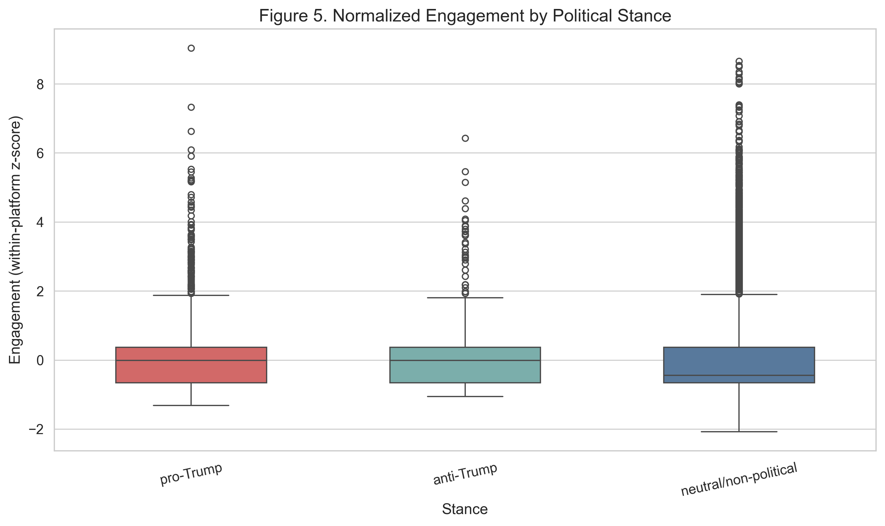

# Project 3 — Blending of Sports Entertainment and Political Messaging

> **Research question.** How do audiences across YouTube, X, and Instagram negotiate and react to the blending of sports entertainment and political messaging in the context of Donald Trump's appearance on Bryson DeChambeau's "Break 50" series?

## About this project

Donald Trump's guest spot on golfer Bryson DeChambeau's "Break 50" YouTube series is a clean test case for what happens when a polarizing political figure is dropped into an ostensibly apolitical entertainment context. We use it to study how audiences on three structurally different platforms — YouTube, Instagram, and X — negotiate the collision of a sports frame and a political frame in real time. The analysis is anchored in framing theory, public sphere theory, the celebrity-politician literature (Street, 2018), the politicization-of-non-political-spaces literature (Wang et al., 2024), and identity-conflict scholarship in sport fandom (Larkin, 2025).

## Data

| Platform | Comments | Window |
|---|---:|---|
| YouTube (`B50_YT_COMMENT.xlsx`) | 45,623 | 2024-07-23 → 2024-08-11 |
| Instagram (`B50_INS_COMMENT.xlsx`) | 11,833 | 2024-07-23 → 2024-09-02 |
| X / Twitter (`B50_X_COMMENT.xlsx`) | 1,008 | 2024-07-23 → 2024-08-01 |
| **Total** | **58,464** | |

Disparate platform schemas were harmonized into a unified `comment_text` field plus a `platform` indicator. Engagement metrics were aggregated into `engagement_raw` (likes + replies for YT/IG; likes + replies + retweets + reference counts + views for X), then normalized within-platform via `log1p` followed by z-score (`engagement_norm`) so that high-volume X views do not artificially dominate the comparison.

## Methods

### Two-dimensional coding

| Dimension | Categories | Trigger logic |
|---|---|---|
| **Political stance** | `pro-Trump` / `anti-Trump` / `neutral` | Dictionary detection (campaign slogans, supportive/critical cues) with rule-guided defaults |
| **Interpretive frame** | `sports/performance` / `politics/ideology` / `blended` | Sports vocabulary vs political vocabulary; comments hitting both dictionaries are computationally derived as `blended` |

The full keyword tables and rule logic are documented in [`CursorPros_REPORT_P3.md`](CursorPros_REPORT_P3.md). Two rounds of explicit, user-calibrated ambiguity resolution handled implied meaning, sarcasm markers (e.g., "/s"), numerical Trump references ("47", "45&47"), and contextual cues like "MAGA" inside golf threads.

### Statistics

Engagement metrics are highly skewed and zero-inflated, so all tests are non-parametric:

- **Categorical comparisons** (cross-platform stance/frame distributions, stance-by-frame association): chi-square tests of independence, with standardized residuals and **Cramér's V** for effect size.
- **Continuous engagement comparisons** (blended vs non-blended): **Mann-Whitney U** with **Cliff's δ**.
- **Engagement across stances**: **Kruskal-Wallis** with Bonferroni-corrected pairwise post-hoc tests.

Statistical findings are then triangulated against representative comment excerpts from each `stance × frame` cell to ground the patterns in the actual language audiences used.

## Key findings

- **Platform culture moderates the public sphere.** `sports/performance` was the dominant frame overall, but **X carries a significantly larger share of explicit political stances and `politics/ideology` framing** than YouTube or Instagram. Instagram's visual-first culture suppresses political discourse; X's text-first architecture amplifies it.
- **Stance and frame co-produce.** `pro-Trump` comments cluster heavily in **`blended`** framing (celebrating golf and politics together as one continuous performance). `anti-Trump` comments retreat into **pure `politics/ideology`**, refusing the sports premise entirely.
- **Polarization is the engagement engine.** Mann-Whitney U confirmed that **blended comments outperform non-blended comments in normalized engagement** at statistical significance. Explicitly political and blended comments achieve higher raw visibility than strictly neutral commentary across all three platforms.
- **Four narratives drive negotiation.** Qualitative reading of high-engagement excerpts surfaces four dominant narratives: **Celebration**, **Backlash**, **Depoliticization**, and **Irony / Banter**.

## Figures

<table>
<tr>
<td align="center" width="50%">
<a href="Visualizations/Figure1_StanceByPlatform.png"></a>
<sub><b>Figure 1.</b> Stance proportions across YouTube, Instagram, and X. X carries a disproportionate share of explicit pro/anti-Trump stances.</sub>
</td>
<td align="center" width="50%">
<a href="Visualizations/Figure2_FrameByPlatform.png"></a>
<sub><b>Figure 2.</b> Frame composition. <code>sports/performance</code> dominates everywhere, but the politics share is markedly higher on X.</sub>
</td>
</tr>
<tr>
<td align="center" width="50%">
<a href="Visualizations/Figure3_StanceFrameAssociation.png"></a>
<sub><b>Figure 3.</b> Stance × frame association. Pro-Trump comments concentrate in <code>blended</code>; anti-Trump comments concentrate in <code>politics/ideology</code>.</sub>
</td>
<td align="center" width="50%">
<a href="Visualizations/Figure4_Engagement_BlendedVsNon.png"></a>
<sub><b>Figure 4.</b> Normalized engagement is significantly higher for blended comments than non-blended ones (Mann-Whitney U).</sub>
</td>
</tr>
<tr>
<td align="center" width="50%">
<a href="Visualizations/Figure5_Engagement_ByStance.png"></a>
<sub><b>Figure 5.</b> Engagement by stance, by platform. On X, explicitly political comments perform best; on YouTube and Instagram, blended/sports framings lead.</sub>
</td>
<td align="center" width="50%">
<a href="Visualizations/Figure6_Integrated_Findings.png"></a>
<sub><b>Figure 6.</b> Integrated findings — the four qualitative narratives audiences use to negotiate the crossover, mapped to stance-frame cells.</sub>
</td>
</tr>
</table>

## Files in this folder

| File | Purpose |
|---|---|
| [`CursorPros_REPORT_P3.md`](CursorPros_REPORT_P3.md) | Full project report with literature review, full keyword tables, results, and discussion. |
| [`CursorPros_PLAN_P3.md`](CursorPros_PLAN_P3.md) | Pre-registered plan with constructs, ethics commitments, and AI use disclosures. |
| [`CursorPros_Presentation_P3.pdf`](CursorPros_Presentation_P3.pdf) | Slide deck. |
| [`Python Script/run_b50_analysis.py`](Python%20Script/run_b50_analysis.py) | End-to-end analysis pipeline (cleaning, classification, statistics). |
| [`Python Script/generate_b50_figures.py`](Python%20Script/generate_b50_figures.py) | Reproduces Figures 1–6. |
| [`AI Verification/Comment_Selection_and_Analysis_Decisions.md`](AI%20Verification/Comment_Selection_and_Analysis_Decisions.md) | Decisions about comment selection, classification rules, and ambiguity resolution. |
| [`AI Verification/Session_Transcript.md`](AI%20Verification/Session_Transcript.md) | Transcript of AI-assisted session for auditability. |
| [`Visualizations/`](Visualizations) | Six PNG figures embedded above. |

## Reproduction

```bash
cd "Python Script"
python run_b50_analysis.py     # produces classified comment tables and statistics
python generate_b50_figures.py # writes Figure1..Figure6 to ../Visualizations/
```

The three `B50_*_COMMENT.xlsx` inputs are not redistributed in this repository. Required Python packages are documented at the top of each script.
