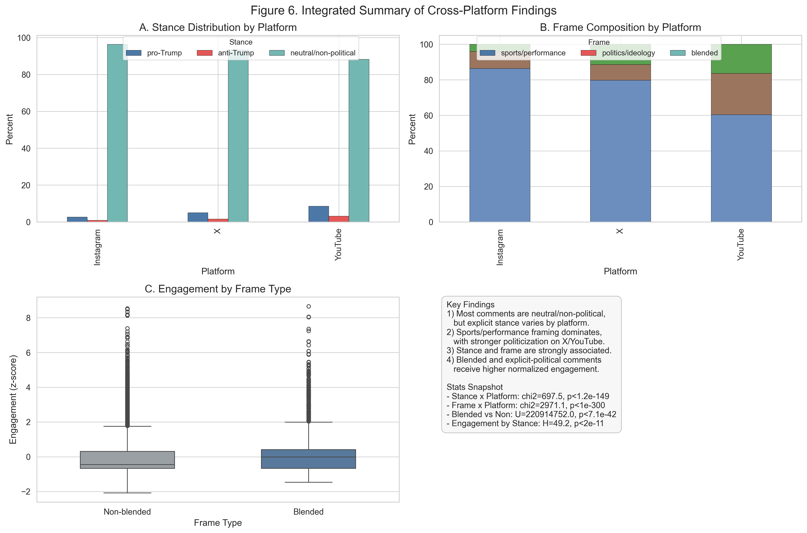

<div align="center">



# Social Issues in Sport

**Three computational case studies of how audiences frame, contest, and negotiate the contemporary sport landscape.**


</div>

---

## About this repository

This repository contains the final group project submission for **KIN 7518 — Social Issues in Sport** (Instructor: Dr. Yizhou Qian). Across three independent case studies, we examine how audiences and content creators construct meaning around contested moments in contemporary sport, applying media framing theory, public sphere theory, authenticity/legitimacy scholarship, and identity-conflict perspectives to user-generated discourse on YouTube, Instagram, and X (formerly Twitter). Each case pairs a focused research question with a transparent, dictionary-guided computational pipeline so that coding logic, data sources, and findings remain auditable.

A casual visitor will find a short overview of each project below, a per-project README inside each folder with data, methods, and key findings, a full report markdown for deeper reading, the Python scripts used to produce the analyses, and the AI verification logs that document where and how generative tools were used.

## Table of contents

- [Project 1 — Clark vs Reese rivalry framing](#project-1--audience-influence-on-the-angel-reese-vs-caitlin-clark-rivalry)
- [Project 2 — TGL League legitimacy](#project-2--the-legitimacy-of-the-tgl-league)
- [Project 3 — Sports entertainment meets political messaging](#project-3--blending-of-sports-entertainment-and-political-messaging)
- [Methods at a glance](#methods-at-a-glance)
- [Repository structure](#repository-structure)
- [Team](#team)
- [AI disclosure](#ai-disclosure)
- [Suggested citation](#suggested-citation)

---

## Project 1 — Audience influence on the Angel Reese vs Caitlin Clark rivalry

> **Research question.** How does social media coverage of Angel Reese's and Caitlin Clark's public comments, particularly the frequency and framing of their references to one another, contribute to the perception of rivalry between the two athletes?

| | |
|---|---|
| **Data** | ARCC dataset: Instagram + YouTube posts, videos, and comments (2017–2024), partitioned into pre-2023 and 2023–2024 phases. |
| **Methods** | Keyword-frequency and comparative text analysis across four constructs (personality, post/mention frequency, skill comparison, beauty standards); chi-square tests of independence; VADER sentiment. |
| **Headline finding** | YouTube discourse is far more rivalry-centered than Instagram (cross-reference rates of **21.6%** mentioning Clark and **13.49%** mentioning Reese on YouTube vs **3.26%** and **4.71%** on Instagram), yet sentiment in those cross-mentions remained slightly **positive** on both platforms — rivalry framing and appreciation coexist. |
| **Read more** | [Full report](Project-1/CursorPros_REPORT_P1.md) · [Plan](Project-1/CursorPros_PLAN_P1.md) · [Slides (PDF)](Project-1/CursorPros_Presentation_P1.pdf) · [Python](Project-1/Python%20Script) · [AI verification](Project-1/AI%20Verfication) |

## Project 2 — The legitimacy of the TGL League

> **Research question.** How do YouTube content creators frame TGL's commercialization of professional golf, and in what ways does audience discourse in the comments reflect public acceptance, resistance, or ambivalence toward a technology-driven, entertainment-first sport model?

| | |
|---|---|
| **Data** | `TGL_VIDEO.xlsx` (n = 355 videos) for creator framing; `TGL_COMMENT.xlsx` (n = 6,102 comments, model-specific subset n = 695) for audience discourse. |
| **Methods** | Dictionary-guided coding for legitimacy stance (LEGIT_POS / LEGIT_NEG / LEGIT_AMB); construct-level analysis of commercialization, technology, and their overlap; iterative AI-assisted verification with cross-pass consistency checks. |
| **Headline finding** | Creator framing is unified — **88.2%** of videos use commercialization language and **78.3%** use technology language, with **68.5%** combining both. Audience reception is fragmented: resistance (**24.9%**) slightly exceeds acceptance (**22.4%**), with ambivalence at **9.1%** and neutral/other at **43.6%**. Strong promotional coherence does not yield legitimacy consensus. |
| **Read more** | [Full report](Project-2/CursorPros_REPORT_P2.md) · [Plan](Project-2/CursorPros_PLAN_P2.md) · [Slides (PDF)](Project-2/CursorPros_Presentation_P2.pdf) · [Mermaid figures](Project-2/Visualizations/TGL_Key_Findings_Figures.md) · [Python](Project-2/Python%20Script) · [AI verification](Project-2/AI%20Verification) |

## Project 3 — Blending of sports entertainment and political messaging

> **Research question.** How do audiences across YouTube, X, and Instagram negotiate and react to the blending of sports entertainment and political messaging in the context of Donald Trump's appearance on Bryson DeChambeau's "Break 50" series?

| | |
|---|---|
| **Data** | 58,464 comments across YouTube (n = 45,623), Instagram (n = 11,833), and X (n = 1,008), collected July–September 2024 immediately after the episode aired. |
| **Methods** | Mixed-methods coding pipeline combining dictionary detection, context-sensitive social rules, and two rounds of user-calibrated ambiguity resolution. Two-dimensional classification: political stance (`pro-Trump` / `anti-Trump` / `neutral`) and interpretive frame (`sports/performance` / `politics/ideology` / `blended`). Non-parametric statistics: chi-square with Cramér's V; Mann-Whitney U with Cliff's δ; Kruskal-Wallis with Bonferroni-corrected post-hoc tests. |
| **Headline finding** | **Blended comments outperform single-frame ones in normalized engagement.** Pro-Trump comments cluster in `blended` framing while anti-Trump comments retreat into pure `politics/ideology`. X amplifies political framing; Instagram preserves the "golf aesthetic." Polarization is the engagement engine. |
| **Read more** | [Full report](Project-3/CursorPros_REPORT_P3.md) · [Plan](Project-3/CursorPros_PLAN_P3.md) · [Slides (PDF)](Project-3/CursorPros_Presentation_P3.pdf) · [Figures](Project-3/Visualizations) · [Python](Project-3/Python%20Script) · [AI verification](Project-3/AI%20Verification) |

---

## Methods at a glance

All three projects follow a four-stage pipeline: **(1) data assembly** from public platform exports (Instagram, YouTube, X) into harmonized text and metadata fields; **(2) construct-driven coding** through curated keyword dictionaries with explicit category boundaries; **(3) verification** through iterative spot-checks, cross-pass comparisons, and AI-assisted consistency review (logged in each project's AI verification folder); and **(4) statistical and interpretive analysis** appropriate to the data — chi-square tests for categorical distributions, non-parametric tests for skewed engagement metrics (Project 3), and qualitative thematic interpretation grounded in framing, legitimacy, and identity-conflict scholarship. Reproduction notes and entry-point scripts live alongside each project's `Python Script/` folder.

## Repository structure

```
Social-Issues-in-Sport/
├── README.md                              ← you are here
├── Project-1/                             Clark vs Reese rivalry framing
│   ├── README.md
│   ├── CursorPros_REPORT_P1.md
│   ├── CursorPros_PLAN_P1.md
│   ├── CursorPros_Presentation_P1.pdf
│   ├── Python Script/
│   ├── AI Verfication/
│   └── Visualizations/
├── Project-2/                             TGL League legitimacy
│   ├── README.md
│   ├── CursorPros_REPORT_P2.md
│   ├── CursorPros_PLAN_P2.md
│   ├── CursorPros_Presentation_P2.pdf
│   ├── Python Script/
│   ├── AI Verification/
│   └── Visualizations/
└── Project-3/                             Sport-political blending (Break 50)
    ├── README.md
    ├── CursorPros_REPORT_P3.md
    ├── CursorPros_PLAN_P3.md
    ├── CursorPros_Presentation_P3.pdf
    ├── Python Script/
    ├── AI Verification/
    └── Visualizations/                    six PNG figures embedded in P3 README
```

## Team

**CursorPros** — KIN 7518, Spring 2026

- Madeleine Durnin
- Hailee Hernandez
- Kaylee Hooper

## AI disclosure

Artificial intelligence was utilized throughout the course of each project. Specific verification methods and notations of use are listed in the corresponding plan for each project, and full audit material lives in each project's AI verification folder:

- Project 1 — [`Project-1/AI Verfication/`](Project-1/AI%20Verfication)
- Project 2 — [`Project-2/AI Verification/`](Project-2/AI%20Verification)
- Project 3 — [`Project-3/AI Verification/`](Project-3/AI%20Verification)

## Suggested citation

> Durnin, M., Hernandez, H., & Hooper, K. (2026). *Social issues in sport: Three computational case studies of audience framing, legitimacy, and political-entertainment blending* [KIN 7518 group project]. GitHub. https://github.com/madeleinedurnin-sketch/Social-Issues-in-Sport
